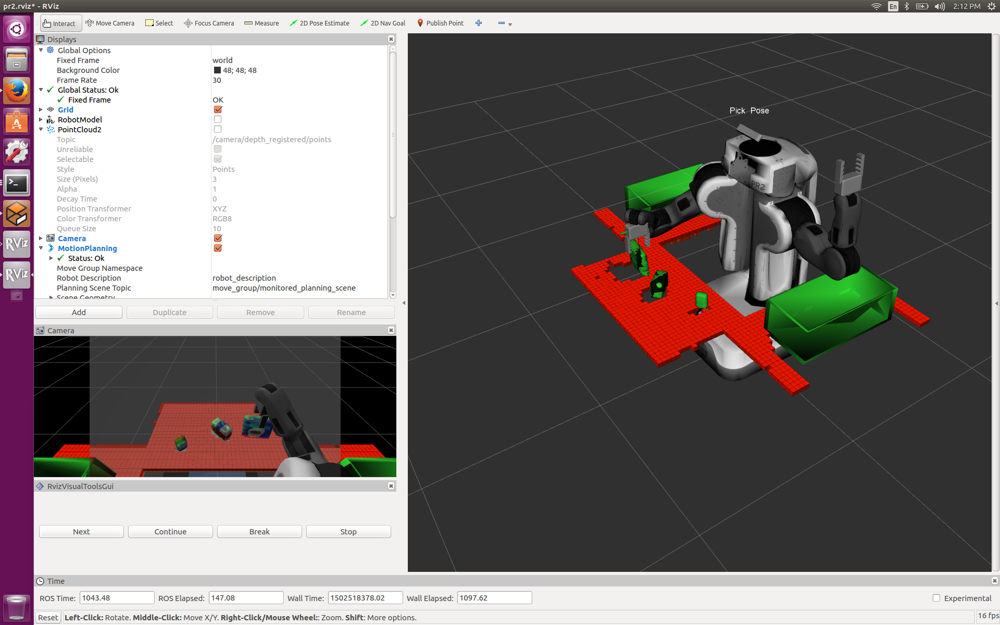
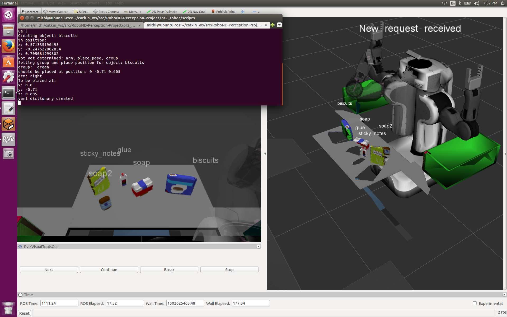

# perception-pr2
A catkin workspace in ROS where a virtual PR2 Robot with an RGBD camera perceives objects and places them
on the appropriate dropbox.

This is my submission as partial fulfillment of [Udacity's Robotics Nanodegree](https://udacity.com/robotics).

# Related Links
Here are some  articles which use neural networks instead of SVM:
- https://research.googleblog.com/2017/07/teaching-robots-to-understand-semantic.html
- http://bair.berkeley.edu/blog/2017/06/27/dexnet-2.0/

# [WRITEUP](./WRITEUP.md)

# Output YAML files
- [Test Scene 1](./src/RoboND-Perception-Project/pr2_robot/scripts/output_1.yaml)
- [Test Scene 2](./src/RoboND-Perception-Project/pr2_robot/scripts/output_2.yaml)
- [Test Scene 3](./src/RoboND-Perception-Project/pr2_robot/scripts/output_3.yaml)

# Files
- [Project Script](./src/RoboND-Perception-Project/pr2_robot/scripts/project.py)
- [Resulting Model](./src/RoboND-Perception-Project/pr2_robot/scripts/model.sav)
- [Capture Features Script](./src/sensor_stick/scripts/capture_features.py)
- [Training Script](./src/sensor_stick/scripts/train_svm.py)
- [Features Script](./src/sensor_stick/src/sensor_stick/features.py)



# Setup
- I ran mine in ubuntu 16.04.2 with ROS full desktop version installed. It has MoveIt! Gazebo and RViz
- Make sure you have `python-pcl` as described [here](https://github.com/mithi/point-cloud-filter)
- Clone this repository
- Install missing dependencies
```
$ cd ~/catkin_ws
$ rosdep install --from-paths src --ignore-src --rosdistro=kinetic -y
```
- Run the command `catkin_make`

# How to use
- Open the pick place launch file in `src/RoboND-Perception-Project/pr2_robot/launch/pick_place_project.launch`
- Change the number `2` to either `1`, `2`, or `3`
```
<!--TODO:Change the world name to load different tabletop setup-->
<arg name="world_name" value="$(find pr2_robot)/worlds/test2.world"/>
<!--TODO:Change the list name based on the scene you have loaded-->
<rosparam command="load" file="$(find pr2_robot)/config/pick_list_2.yaml"/>
```
- Run this on one terminal `$ roslaunch pr2_robot pick_place_project.launch`
- On another terminal, run `$ rosrun pr2_robot project.py`


